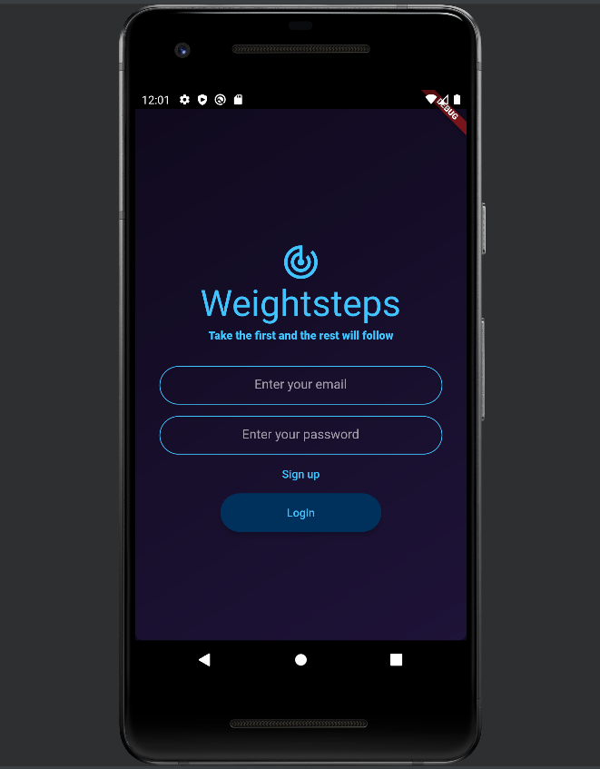
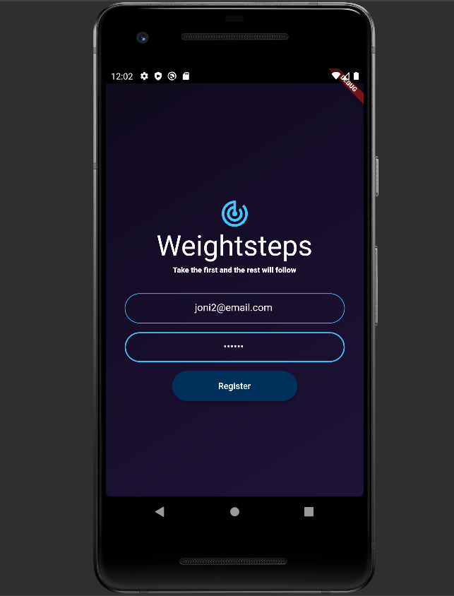
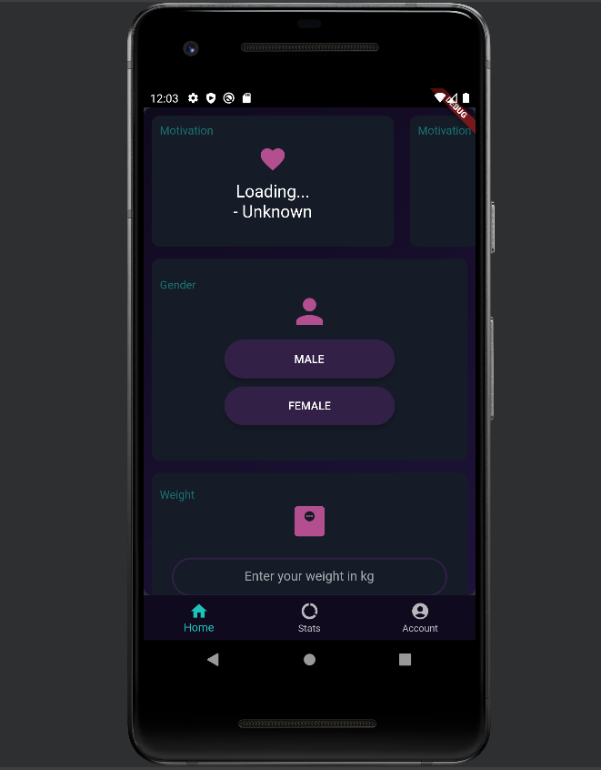
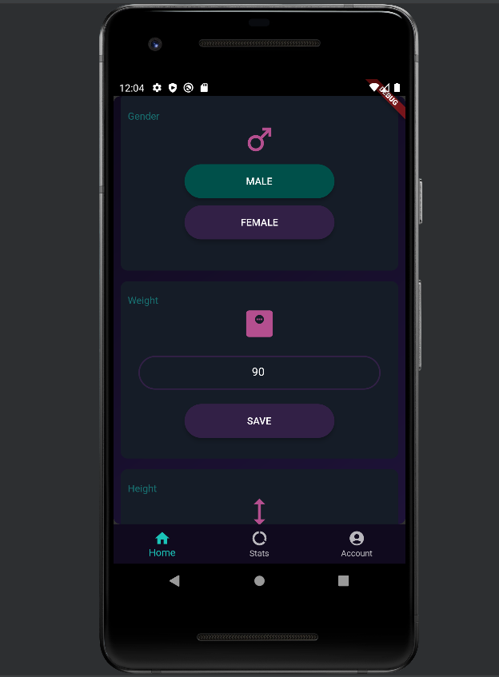
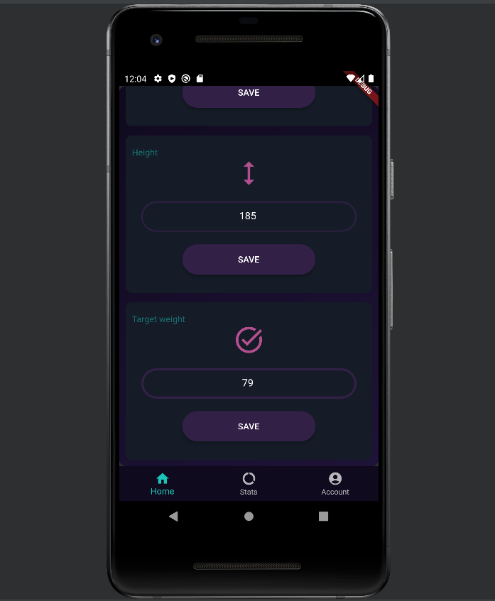
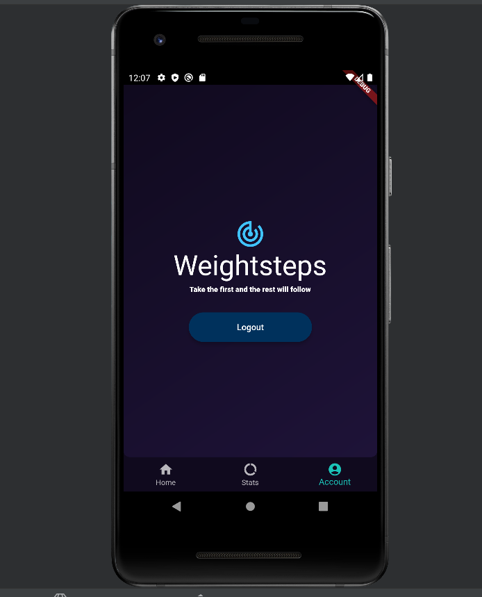
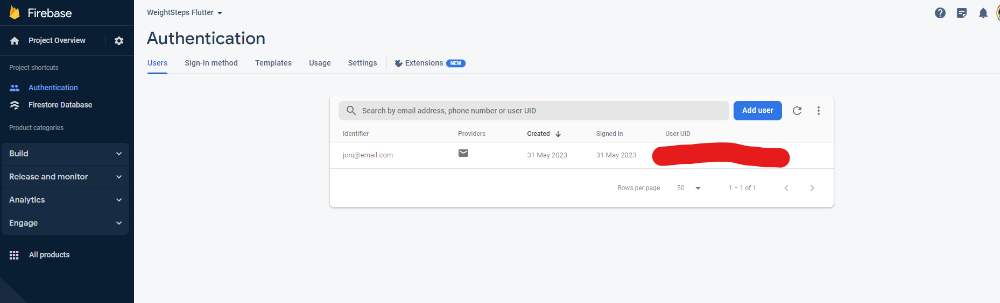
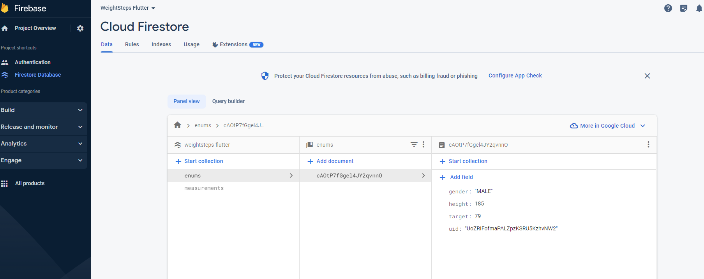
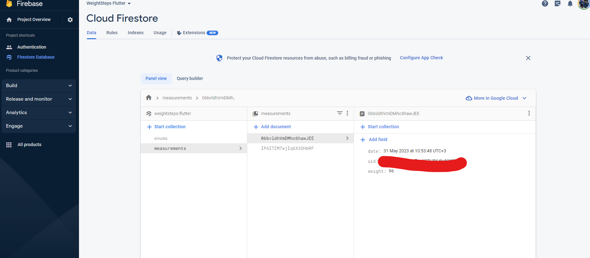

# Android App Codebase Summary

This GitHub repository contains an Android application codebase. The application allows user to track their
fitness progress by recording weight, bmi, circumference and other metrics. The application also provides daily motivation quotes.

## Firebase

